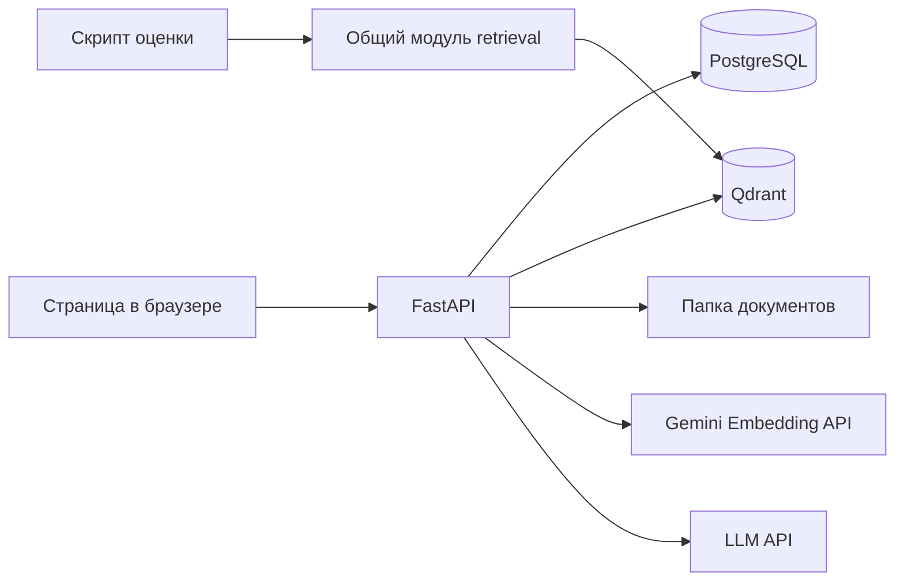

# EvidenceChat — RAG-проект для Junior ML-разработчика

## 1. Идея и границы проекта

EvidenceChat — приложение, в котором пользователь загружает документы и задаёт вопросы по их содержимому. Система находит подходящие фрагменты в векторной базе, передаёт их LLM и показывает ответ со ссылками на источники.

Цель проекта — самостоятельно реализовать и объяснить весь RAG-процесс: извлечение текста, чанкинг, embeddings, поиск, генерацию и оценку качества. Проект рассчитан на одного Junior-разработчика, локальный запуск и демонстрацию для портфолио.

### Обязательные возможности

- Регистрация и вход.
- Загрузка PDF с текстовым слоем, TXT и Markdown.
- Просмотр статуса обработки и повтор после ошибки.
- Чат по своим документам, история диалогов и ссылки на найденные фрагменты.
- Удаление документов вместе с их векторами.
- Изоляция данных пользователей.
- Сравнение dense retrieval с BM25 и эксперименты с чанкингом.
- Запуск через Docker Compose и тесты основных сценариев.

### Ограничения первой версии

Один процесс FastAPI, один сервер, небольшой корпус и несколько демонстрационных пользователей. Начальные лимиты: до 5 MiB, 50 страниц и 300 чанков на документ, до 20 документов на пользователя. Это ограничения приложения, а не измеренная производительность.

В одном запуске используется одна embedding-модель Gemini и один выбранный провайдер генерации: Gemini или Groq. Выбор выполняется в `llm/factory.py`; автоматического переключения между провайдерами при ошибке нет. OCR, потоковая генерация, обучение моделей, автоматическое продолжение задач после сбоя и высокая доступность в него не входят.

## 2. Стек и общая схема

| Компонент | Решение | Для чего нужен |
|---|---|---|
| Backend | FastAPI, Pydantic Settings | HTTP API, валидация и конфигурация |
| Прикладная БД | PostgreSQL, SQLAlchemy, Alembic | Пользователи, документы, история |
| Векторная БД | Qdrant, отдельный контейнер | Хранение embeddings и поиск |
| Embeddings | `EmbeddingProvider` → `GeminiProvider`, SDK `google-genai` | Векторизация документов и запросов |
| LLM | `LLMProvider` → Gemini или Groq | Генерация ответа по контексту |
| Клиенты API | `google-genai` для Gemini, `openai` с Groq base URL для Groq | Реализация провайдеров |
| PDF | pypdf | Извлечение текста и номеров страниц |
| Обработка файлов | FastAPI BackgroundTasks | Индексация после HTTP-ответа |
| Frontend | HTML, CSS, JavaScript | Загрузка документов и чат |
| Проверки | pytest, Ruff | Тесты и проверка кода |
| Окружение | Docker Compose, закреплённые зависимости | Воспроизводимый запуск |



Frontend раздаётся тем же FastAPI-приложением. Для локальной демонстрации отдельные frontend-сервер, Redis и worker не нужны.

PostgreSQL определяет владельца и состояние документа. Qdrant хранит векторы, тексты чанков и их координаты. Оригиналы лежат в persistent volume и позволяют восстановить индекс.

## 3. Структура проекта

```text
project/
├── app/
│   ├── main.py                # создание приложения, lifespan, роутеры
│   ├── config.py              # настройки из окружения
│   ├── dependencies.py        # сессия БД, текущий пользователь, сервисы
│   ├── errors.py              # ошибки приложения и HTTP mapping
│   ├── db/
│   │   ├── session.py
│   │   └── models.py          # четыре SQLAlchemy-модели
│   ├── auth/
│   │   ├── router.py
│   │   ├── schemas.py
│   │   ├── service.py
│   │   └── security.py
│   ├── documents/
│   │   ├── router.py
│   │   ├── schemas.py
│   │   ├── service.py
│   │   ├── repository.py
│   │   ├── ingestion.py
│   │   ├── extractors.py
│   │   └── chunking.py
│   ├── chat/
│   │   ├── router.py
│   │   ├── schemas.py
│   │   ├── service.py
│   │   ├── repository.py
│   │   └── prompts.py
│   ├── rag/
│   │   ├── retrieval.py
│   │   └── vector_store.py    # конкретная обёртка над Qdrant
│   └── llm/
│       ├── base.py            # LLMProvider и EmbeddingProvider
│       ├── gemini_provider.py # Gemini: генерация и embeddings
│       ├── groq_provider.py   # Groq: только генерация
│       └── factory.py         # выбор и создание провайдеров
├── frontend/
│   ├── index.html
│   ├── app.js
│   └── styles.css
├── eval/
│   ├── corpus/                # небольшой открытый корпус
│   ├── dataset.jsonl
│   ├── bm25.py
│   ├── run.py
│   ├── configs.json
│   ├── results/
│   └── README.md
├── tests/
│   ├── conftest.py
│   ├── test_auth.py
│   ├── test_documents.py
│   ├── test_chat.py
│   ├── test_retrieval.py
│   └── test_llm.py             # контракты, фабрика и ошибки SDK
├── alembic/
├── scripts/
│   └── rebuild_index.py
├── .github/workflows/ci.yml
├── Dockerfile
├── compose.yaml
├── pyproject.toml
├── uv.lock
├── .env.example
├── .gitignore
├── .dockerignore
├── ARCHITECTURE.md
└── README.md
```

Файлы добавляются по мере реализации. Отдельные слои domain, ports, Unit of Work и универсальные repositories для этой версии не нужны. Двух интерфейсов в `llm/base.py` и небольшого `factory.py` достаточно для выбора провайдеров.

### Правила организации кода

- Router разбирает HTTP-запрос и вызывает сервис.
- Service выполняет сценарий: проверить доступ, найти контекст, вызвать модель, сохранить результат.
- Repository содержит SQL-запросы; простой поиск пользователя допустим внутри auth/service до появления повторяющегося кода.
- `vector_store.py` содержит операции Qdrant; `gemini_provider.py` и `groq_provider.py` — взаимодействие с API моделей.
- Сервисы принимают `LLMProvider` и `EmbeddingProvider` из `base.py`; конкретные классы в прикладном коде создаёт только `factory.py`.
- `dependencies.py` связывает HTTP-слой с фабрикой через FastAPI `Depends`. BackgroundTask и eval-скрипт получают провайдеров из той же фабрики без `Depends`.
- Сервисы не бросают `HTTPException`: ошибки приложения переводятся в HTTP-коды в одном месте.
- Сервис может работать с SQLAlchemy Session. Строгая независимость от ORM не является требованием.
- Offline evaluation использует те же функции чанкинга и retrieval, что и приложение.

Начальный backend синхронный: обычные `def`-роуты, SQLAlchemy Session и синхронные клиенты. FastAPI выполняет синхронные обработчики в thread pool. Это позволяет не смешивать блокирующий inference с `async def`; вспомогательные функции, вызванные из async-кода напрямую, автоматически в thread pool не переносятся. [FastAPI: concurrency](https://fastapi.tiangolo.com/async/).

Каждый HTTP-запрос и фоновая задача создают собственную сессию БД. SDK-клиенты провайдеров создаются при старте и переиспользуются в пределах одного процесса. Веса моделей локально не загружаются. Внешние вызовы имеют timeout и ограничения параллельности; обработка одного документа по-прежнему занимает один слот приложения.

### 3.1. Контракты `llm/base.py`

Генерация и embeddings — независимые задачи. `LLMProvider` возвращает готовый текст, `EmbeddingProvider` — векторы и идентификатор embedding-модели.

```python
from abc import ABC, abstractmethod


class LLMProvider(ABC):
    @abstractmethod
    def generate_answer(self, prompt: str) -> str:
        raise NotImplementedError


class EmbeddingProvider(ABC):
    @property
    @abstractmethod
    def embedding_model_name(self) -> str:
        raise NotImplementedError

    @abstractmethod
    def embed_text(self, text: str) -> list[float]:
        raise NotImplementedError

    @abstractmethod
    def embed_batch(self, texts: list[str]) -> list[list[float]]:
        raise NotImplementedError
```

Имя `generate_answer` одинаково в базовом классе, обеих реализациях, сервисах и тестовых подменах. `embed_text` предназначен для поискового запроса, `embed_batch` — для списка фрагментов документа; это позволяет адаптеру отдельно настроить представление запроса и документа, если выбранная модель этого требует.

`embed_batch` сохраняет порядок входных текстов и возвращает столько же векторов. Пустой список даёт `[]` без обращения к API. Метод означает обработку списка, а не обещание отправить документ любого размера за один HTTP-запрос: большие списки разделяются на допустимые батчи.

### 3.2. Реализации и `factory.py`

| Класс | Наследование | Ответственность |
|---|---|---|
| `GeminiProvider` | `LLMProvider, EmbeddingProvider` | Генерация через `generate_content`, embeddings через `embed_content` |
| `GroqProvider` | `LLMProvider` | Генерация через OpenAI-совместимый `chat.completions.create` |

`GroqProvider` не наследует `EmbeddingProvider` и не содержит embedding-методов с заглушками. Для OpenAI SDK в нём явно задаются `base_url="https://api.groq.com/openai/v1"` и ключ Groq. Это обращение к Groq, а не к сервису OpenAI. [Groq: OpenAI Compatibility](https://console.groq.com/docs/openai).

Фабрика предоставляет две точки входа:

```python
def get_llm_provider() -> LLMProvider: ...
def get_embedding_provider() -> EmbeddingProvider: ...
```

Поведение фабрики:

- `LLM_PROVIDER=gemini` → `GeminiProvider` для генерации.
- `LLM_PROVIDER=groq` → `GroqProvider` для генерации.
- `get_embedding_provider()` всегда возвращает `GeminiProvider` в этой версии.
- При выборе Gemini для обеих задач фабрика переиспользует один экземпляр `GeminiProvider`.
- При выборе Groq создаются два экземпляра: Groq для ответов и Gemini для embeddings. Ключ Gemini всё равно нужен.
- Неизвестное значение настройки вызывает понятную ошибку конфигурации; не подставляется другой провайдер молча.

Для хранения экземпляров достаточно небольшого кеша фабрики, инициализируемого в lifespan до приёма запросов. Plugin registry, отдельный DI-контейнер и универсальная фабрика для всех внешних сервисов не нужны. Конкретные классы допустимо импортировать непосредственно в их unit-тестах.

Пример вызовов в сервисах:

```python
# chat/service.py
answer = llm_provider.generate_answer(prompt)

# rag/retrieval.py
query_vector = embedding_provider.embed_text(question)

# documents/ingestion.py
vectors = embedding_provider.embed_batch(chunk_texts)
embedding_model = embedding_provider.embedding_model_name
```

`chat/prompts.py` собирает вопрос, историю и источники в одну строку, соответствующую `generate_answer(prompt: str)`. Timeout, model ID и предел output tokens настраиваются внутри адаптера через Settings; сервис не передаёт объекты SDK.

Ошибки SDK преобразуются в `LLMError` или `EmbeddingError` из `app/errors.py`. Пустой текст, неполный список embeddings и некорректный вектор также считаются ошибкой провайдера. Исходная причина сохраняется через `raise ... from e`, а пользователю возвращается безопасное сообщение без полного ответа SDK. Неожиданные ошибки кода не перехватываются как обычный отказ API.

## 4. Схема PostgreSQL

Для ID используются UUID, для времени — `TIMESTAMPTZ` и серверное значение `now()`. `?` означает nullable.

```text
users
  id UUID PK
  email TEXT UNIQUE NOT NULL
  password_hash TEXT NOT NULL
  created_at TIMESTAMPTZ NOT NULL

conversations
  id UUID PK
  user_id UUID FK users.id NOT NULL
  title TEXT?
  created_at TIMESTAMPTZ NOT NULL

messages
  id UUID PK
  conversation_id UUID FK conversations.id NOT NULL
  sequence INT NOT NULL
  role TEXT NOT NULL                 # user / assistant
  content TEXT NOT NULL
  sources JSONB?                     # только для ответа
  created_at TIMESTAMPTZ NOT NULL
  UNIQUE(conversation_id, sequence)

documents
  id UUID PK
  user_id UUID FK users.id NOT NULL
  filename TEXT NOT NULL             # отображаемое имя
  storage_path TEXT NOT NULL         # путь, сформированный сервером
  status TEXT NOT NULL               # processing / ready / failed / deleting
  index_version TEXT NOT NULL
  embedding_model TEXT NOT NULL      # EmbeddingProvider.embedding_model_name
  chunk_count INT NOT NULL DEFAULT 0
  error_code TEXT?
  created_at TIMESTAMPTZ NOT NULL
```

`documents.embedding_model` записывается из `get_embedding_provider().embedding_model_name` для используемого индекса. Модель генерации здесь не хранится: переключение Gemini ↔ Groq для ответа не меняет векторы.

Email нормализуется единообразно перед сохранением и поиском. Для role/status задаются `CHECK`-ограничения.

Основные индексы:

- `documents(user_id, created_at, id)` для списка документов.
- `conversations(user_id, created_at, id)` для списка диалогов.
- `UNIQUE(conversation_id, sequence)` для истории сообщений.

Для простого списка достаточно `limit/offset` с ограничением `limit` и устойчивой сортировкой. При удалении диалога сообщения удаляются через `ON DELETE CASCADE`. Удаление документа проходит через сервис, поскольку затрагивает ещё Qdrant и файловую систему.

Таблицы задач, сессий, версий чанков и экспериментальных запусков не нужны. Настройки экспериментов и результаты сохраняются в файлах.

## 5. Документы: загрузка, обработка и удаление

### 5.1. Загрузка

```text
POST /documents
    → проверить пользователя, формат и лимиты
    → сохранить файл под случайным серверным именем
    → создать Document(status=processing)
    → зарегистрировать BackgroundTask(document_id)
    → 202 Accepted с document_id
```

Файл читается порциями, с проверкой фактического размера. Поддерживаются только PDF, TXT и MD; расширение и Content-Type проверяются вместе с содержимым. Загруженные файлы не раздаются как статические ресурсы.

Одновременно принимается одна задача индексации на приложение. Слот резервируется до создания записи и освобождается в `finally`; если он занят, новый запрос получает 429 с предложением повторить позже. Это простой предел для локального демо, а не очередь задач.

Если сохранение записи не удалось, сервис удаляет созданный файл best effort. Переданный в BackgroundTask аргумент — ID документа, а не HTTP-сессия БД или объект UploadFile.

### 5.2. Обработка

```text
1. Открыть свою сессию БД и прочитать документ.
2. Извлечь текст и номера страниц.
3. Разбить текст на чанки.
4. Получить EmbeddingProvider из фабрики и вызвать embed_batch для батчей чанков.
5. Записать точки в Qdrant и дождаться завершения операций.
6. После успеха всех батчей установить status=ready, chunk_count и embedding_model.
7. При исключении установить status=failed и безопасный error_code.
```

Фоновая функция синхронная. Сетевые вызовы имеют timeout; число страниц и извлечённых чанков ограничено. Соединение и SQL-транзакция не удерживаются всё время embedding и записи в Qdrant: чтение и обновление статуса выполняются короткими отдельными транзакциями.

BackgroundTasks исполняет работу внутри приложения и не является долговечной очередью. При остановке процесса задача может оборваться. Для этого проекта принят явный порядок: после полного перезапуска, до открытия API, оставшиеся `processing` переводятся в `failed` с кодом `processing_interrupted`; пользователь запускает повтор кнопкой. Автоматическое продолжение не обещается. [FastAPI: Background Tasks](https://fastapi.tiangolo.com/tutorial/background-tasks/).

Приложение запускается с **одним worker-процессом**. Несколько реплик и rolling restart с этим механизмом восстановления не поддерживаются.

### 5.3. Повтор обработки

`POST /documents/{id}/retry` разрешён только для `failed`:

1. Проверить владельца, доступность слота и наличие оригинала.
2. Атомарно перевести `failed → processing`; конкурентный запрос получает 409.
3. В фоновой задаче удалить все старые точки этого документа с ожиданием завершения.
4. Обработать исходный файл заново.

Для ID точек используется `UUIDv5(document_id, chunk_index)`. Повторная запись того же чанка заменяет точку. Предварительное удаление нужно, чтобы не оставались старые чанки при изменившемся количестве фрагментов.

### 5.4. Удаление

1. Проверить владельца. Удаление `processing` возвращает 409: сначала нужно дождаться завершения или восстановления после сбоя.
2. В короткой транзакции перевести `ready/failed → deleting`. Retry для такого документа запрещён.
3. Удалить его точки из Qdrant, дождаться результата и удалить оригинал.
4. Удалить запись PostgreSQL; вернуть 204.

Если Qdrant или файловая система недоступны, запись остаётся `deleting`, а API возвращает временную ошибку. Повтор DELETE продолжает очистку; отсутствие уже удалённого файла или точек считается успехом.

Все поисковые запросы ограничиваются документами `ready`. Поэтому частичный индекс и документ с незавершённым удалением не используются. Переходы retry/delete выполняются условным UPDATE или с короткой блокировкой строки, чтобы конкурирующие запросы не запускали несовместимые действия.

После аварии в Qdrant или папке файлов могут оставаться неиспользуемые данные. Для небольшого демо достаточно проверки и очистки скриптом при обслуживании. Распределённая транзакция между хранилищами не реализуется.

## 6. Чанкинг и embeddings

PDF извлекается постранично. PDF без текстового слоя, пустой или повреждённый файл получает понятную ошибку; OCR отсутствует. TXT и MD принимаются в UTF-8. Ссылки внутри Markdown не скачиваются.

Начальная стратегия — разбиение по абзацам с ограничением токенов. Слишком длинный абзац делится на перекрывающиеся окна. Для PDF чанк остаётся внутри страницы, что упрощает отображение источника.

Начальные параметры: `chunk_size=320`, `overlap=48`. Это гипотеза для экспериментов. Счётчик токенов выбирается под embedding-модель; при отсутствии точного локального tokenizer применяется консервативное ограничение длины с запасом. Способ подсчёта фиксируется в конфигурации эксперимента. Число символов нельзя выдавать за точное число токенов.

Для Gemini embeddings:

- Используется model ID из `GEMINI_EMBEDDING_MODEL`; свойство `embedding_model_name` возвращает именно этот ID.
- Размерность берётся из проверенной конфигурации выбранной модели и сверяется с длиной каждого возвращённого вектора и коллекцией Qdrant.
- В Qdrant используется cosine distance; настройка нормализации одинакова для документов и запросов и записана в manifest.
- В `embed_text` и `embed_batch` применяются согласованные правила кодирования. Retrieval-specific параметры используются только если их поддерживает выбранная модель. Префиксы другой embedding-модели автоматически не добавляются.
- Проверяются число векторов, их порядок, непустота и отсутствие NaN/infinity. Ограничения API учитываются до отправки запроса.

Методы и ограничения выбранной модели проверяются по [документации Gemini embeddings](https://ai.google.dev/gemini-api/docs/embeddings). Model ID задаётся конфигурацией, чтобы его можно было заменить при прекращении поддержки. `text-embedding-004` не используется для нового индекса: Google указывает её отключение 14 января 2026 года. [Сроки поддержки Gemini](https://ai.google.dev/gemini-api/docs/deprecations).

Начальный размер батча — 16 текстов, если он укладывается в лимиты выбранной модели. Один batch может потребовать нескольких вызовов адаптера или API. Запрос пользователя векторизуется через `embed_text`, список чанков — через `embed_batch`.

## 7. Qdrant и retrieval

### 7.1. Представление данных

Одна коллекция `document_chunks_v1`, один вектор на чанк. Payload:

```json
{
  "user_id": "uuid",
  "document_id": "uuid",
  "chunk_index": 0,
  "text": "Текст фрагмента",
  "filename": "guide.pdf",
  "page": 3,
  "index_version": "v1"
}
```

Для TXT/MD `page=null`. Для фильтруемых `user_id` и `document_id` создаются payload-индексы.

Конфигурация индекса сохраняется в `data/index_manifest.json`: provider `gemini`, `embedding_model_name`, размерность, правила кодирования/нормализации, chunking и index version. Если облачный API не предоставляет неизменяемую revision модели, сохраняются доступный model ID и дата построения индекса; полная воспроизводимость внешнего сервиса не обещается. При запуске она сравнивается с настройками. Несовпадение требует явного перестроения индекса; смешивать разные embedding-модели в одной коллекции нельзя.

Смена модели или чанкинга выполняется с остановленным приложением через `scripts/rebuild_index.py`: создать новую коллекцию, повторно обработать сохранённые оригиналы, проверить результат и обновить настройки/manifest. Для demo достаточно окна обслуживания; переключение без остановки не требуется.

### 7.2. Поиск

```text
вопрос + user_id
    → получить из PostgreSQL ID готовых документов пользователя
    → get_embedding_provider().embed_text(question)
    → Qdrant search с фильтрами user_id AND document_id IN ready_ids
    → top-k фрагментов
    → повторно проверить доступность найденных документов
    → вернуть текст и метаданные
```

Если `ready_ids` пуст, retrieval сразу возвращает пустой список. Удалять фильтры в этом случае нельзя. `user_id` всегда берётся из авторизации. Qdrant поддерживает условия фильтрации payload; фильтр применяется в самом поисковом запросе. [Qdrant: Filtering](https://qdrant.tech/documentation/search/filtering/).

Стартовое `top_k=5`. Этот параметр выбирается на небольшом наборе вопросов вместе с размером чанка. Семантически похожий фрагмент не обязательно содержит ответ: similarity не показывается как вероятность правильности.

Соседние сильно перекрывающиеся чанки можно дедуплицировать после baseline-оценки. Hybrid search, HNSW tuning и reranking не нужны для завершения первой версии.

## 8. Чат и источники

```text
POST /conversations/{id}/messages
    → проверить владельца диалога и входной текст
    → получить последние успешные пары сообщений
    → найти контекст в документах пользователя
    → собрать prompt с метками [S1], [S2], ...
    → вызвать llm_provider.generate_answer(prompt) с настроенными timeout и лимитом output tokens
    → проверить метки источников
    → одной SQL-транзакцией сохранить user и assistant
    → вернуть ответ и sources
```

Сервис не держит SQL-транзакцию во время внешнего вызова. История сортируется по `sequence`; следующая пара получает два последовательных номера.

Один диалог обрабатывает один запрос одновременно. Достаточно набора занятых conversation ID под `threading.Lock`; второй запрос получает 409, а запись освобождается в `finally`. Это ограничение корректно только при одном API-процессе.

При ошибке генерации пара сообщений не сохраняется: введённый вопрос остаётся в UI, пользователь повторяет его вручную. Автоповторы генерации отключены. Если соединение оборвалось после сохранения ответа, frontend сначала обновляет историю. Полная идемпотентность запросов не входит в первую версию.

### Контекст и отказ

Система отвечает только по документам. Если готовых документов нет, она возвращает фиксированное сообщение без вызова LLM и пустой список sources. Если найденные фрагменты не позволяют ответить, prompt требует сказать об отсутствии информации; явный отказ также может быть без цитат. Качество таких отказов проверяется отдельно; наличие этой инструкции не гарантирует отсутствие галлюцинаций.

Недоступность Qdrant или LLM показывается как ошибка сервиса, а не как «ответа нет в документах».

В prompt передаются вопрос, до трёх последних успешных пар и до пяти найденных чанков. Дополнительно проверяется общий token budget выбранной LLM с запасом для ответа. При переполнении сначала убирается старая история, затем менее релевантные фрагменты.

Поиск первой версии использует текущий вопрос. Пользователю предлагается формулировать его самостоятельно: автоматическое уточнение местоимений и query rewriting не реализуются.

### Ссылки на источники

Каждому фрагменту присваивается локальная метка. Модель использует только эти метки; сервер проверяет их существование и формирует `sources` из реально процитированных чанков. Неизвестная метка или содержательный ответ без ссылок приводят к понятной ошибке проверки ответа, без автоматической цепочки repair-вызовов.

В `messages.sources` хранятся `label`, `document_id`, `point_id`, filename, page и index version. Текст для панели источника выдаётся через авторизованный endpoint, а не напрямую из Qdrant в браузер.

Документы повторно проверяются перед сохранением ответа. При удалении источника во время генерации ответ отклоняется. Для этой финальной проверки и сохранения берётся короткая SQL-блокировка строк документов, совместимая с порядком блокировок удаления.

Удаление документа закрывает доступ к его фрагментам, но не стирает ранее сохранённый текст диалога. UI отмечает источник как недоступный. После перестроения индекса старые ссылки также могут стать недоступными; они не подменяются новыми фрагментами.

## 9. Авторизация и базовая безопасность

- Пароли хешируются Argon2id библиотекой, а не самописным алгоритмом.
- После входа выдаётся короткоживущий access JWT, например на 30 минут.
- Проверяются подпись, фиксированный разрешённый алгоритм, `exp`, `sub`, `iss` и `aud`.
- Refresh-токенов нет: после истечения требуется повторный вход.
- Frontend держит JWT в памяти страницы. Перезагрузка страницы требует входа; localStorage для токенов не используется.
- Выход удаляет токен из памяти. Уже выданный JWT остаётся действительным до истечения срока — это ограничение первой версии.
- Чужой или отсутствующий документ/диалог возвращает одинаковый 404.
- Все SQL-операции используют параметры; пути к файлам формирует сервер.
- Для текста ответа используется `textContent`. HTML из документов и ответов не исполняется.
- Пароли, токены, ключи и содержимое документов не попадают в логи.
- Документ рассматривается как данные, а не источник инструкций. У LLM нет доступа к shell, браузеру и инструментам.

UI сообщает, что тексты чанков и поисковые запросы отправляются в Gemini для embeddings, а вопрос, история и отобранные фрагменты — выбранному провайдеру генерации. При `LLM_PROVIDER=groq` это два внешних сервиса: Gemini и Groq. API-ключи остаются только на backend.

Для публичного демо дополнительно нужны HTTPS, ограничения запросов и бюджет провайдера. До этого достаточно локальной демонстрации или записи видео; публичный запуск не является условием завершения проекта.

## 10. ML-оценка: обязательная часть портфолио

### 10.1. Небольшой собственный датасет

Выбрать одну тему и 10–20 открытых документов с подходящей лицензией. Подготовить 50–80 вопросов вручную: прямые факты, перефразировки, точные термины и 10–15 вопросов без ответа в корпусе. Наличие русских/английских примеров должно соответствовать выбранным документам.

Для каждого вопроса сохранить:

```json
{
  "id": "q01",
  "question": "Какое ограничение описано для загрузки?",
  "answerable": true,
  "relevant_documents": ["guide_v1"],
  "evidence": [{"document_key": "guide_v1", "page": 3, "quote": "Проверенный фрагмент источника"}],
  "reference_answer": "Краткий правильный ответ",
  "split": "dev"
}
```

ID документа стабилен и не зависит от PostgreSQL. Для корпуса фиксируются hashes файлов. Evidence-цитаты позволяют проверить, попал ли в контекст нужный фрагмент, а не просто правильный документ.

Разделить вопросы примерно 70/30 на dev и test, сохранив примеры разных типов в обеих частях. Очень похожие вопросы и их переводы должны попасть в одну часть. Параметры выбираются по dev; test используется после выбора. Поисковый индекс содержит документы обеих частей — это нормально, но test-ответы не используются для настройки.

Маленький набор позволяет сравнить решения на своём корпусе. Он не доказывает универсальное превосходство модели; в отчёте указывается количество примеров.

### 10.2. Три эксперимента

| Запуск | Конфигурация | Что проверяем |
|---|---|---|
| A | BM25 по тем же чанкам | Качество простого лексического поиска |
| B | Dense Gemini embeddings, 320/48 | Качество семантического поиска |
| C | Dense с другим chunk_size или overlap | Влияние разбиения текста |

BM25 реализуется только в `eval/bm25.py`, не в пользовательском API. Все варианты получают одинаковые вопросы и корпус. Для B и C удобно сравнить размеры 192/320/448, оставив остальные параметры одинаковыми; затем отдельно проверить overlap. Не нужно перебирать десятки моделей.

### 10.3. Метрики

Основные document-level метрики считаются после удаления повторяющихся документов из выдачи:

```text
Recall@k = число найденных релевантных документов / число всех релевантных документов
Hit@k    = 1, если найден хотя бы один релевантный документ, иначе 0
MRR@k    = среднее 1 / позиции первого релевантного документа;
           если его нет в top-k, вклад равен 0
```

Здесь `k` означает число уникальных документов; для сравнения используются, например, k=3 и k=5. В offline-оценке извлекается расширенный список чанков, достаточный для получения k уникальных документов; глубина фиксируется одинаково для всех вариантов. На answerable-вопросах дополнительно вручную проверить, содержит ли фактический контекст для LLM достаточное evidence. Эта проверка нужна: правильный документ с неправильным чанком не помогает ответить.

Для 20–30 выбранных вопросов оценить ответ вручную по простой рубрике:

- Правильный ли ответ: да / частично / нет.
- Поддерживаются ли основные утверждения показанными источниками.
- Правильно ли система отказалась отвечать, когда данных нет.

Отдельно посчитать ложные ответы на неответимых вопросах и лишние отказы на ответимых. Разделять результаты retrieval и генерации; не сводить их к неопределённому «проценту точности RAG».

Измерить среднее время и p95 retrieval без LLM, отдельно время генерации. Указать число запросов, оборудование, размер корпуса и отдельно время первого и повторных API-вызовов; p95 на маленькой выборке нестабилен. Token usage можно записывать в адаптере, если API его предоставляет; возвращаемое значение `generate_answer` остаётся строкой. Отдельно учитывать время и число embedding-запросов.

### 10.4. Результат экспериментов

Каждый запуск сохраняет config, Git commit, model ID генерации и embeddings, версию данных, дату вызовов API, выдачу по query ID и метрики в JSON/CSV. BM25 не обращается к моделям; для dense-экспериментов embeddings фиксированного eval-корпуса можно кешировать по hash текста и embedding-конфигурации, чтобы не оплачивать повторные вычисления. Таблица в `eval/README.md` содержит результаты A/B/C, объяснение выбранных параметров и 5–10 разобранных ошибок.

Достаточно таблицы сравнения и одного графика «качество — время». Notebook допустим для анализа, но расчёт embeddings, поиск и метрики должны воспроизводиться Python-скриптом. MLflow, LLM-as-a-judge и fine-tuning не обязательны.

## 11. API и интерфейс

| Метод и путь | Назначение |
|---|---|
| `POST /auth/register` | Создать пользователя |
| `POST /auth/login` | Получить access JWT |
| `POST /documents` | Загрузить документ, 202 |
| `GET /documents` | Получить свои документы и статусы |
| `GET /documents/{id}` | Узнать результат обработки |
| `POST /documents/{id}/retry` | Повторить failed-обработку, 202 |
| `DELETE /documents/{id}` | Удалить документ и точки, 204 |
| `GET /documents/{id}/chunks/{point_id}` | Получить свой фрагмент источника |
| `POST /conversations` | Создать диалог |
| `GET /conversations` | Список своих диалогов |
| `GET /conversations/{id}/messages` | История |
| `POST /conversations/{id}/messages` | Получить ответ |
| `GET /health` | Проверить состояние приложения, PostgreSQL и Qdrant |

Endpoint фрагмента принимает ожидаемую index version из сохранённого источника как query-параметр. Он проверяет владельца документа, соответствие `point_id` этому документу и совпадение ожидаемой версии с текущей. Несовпадение означает недоступность прежнего источника.

Для UI достаточно списка документов, поля загрузки, истории диалога и панели источников. Во время генерации кнопка отправки отключена. Статус документа опрашивается раз в несколько секунд; polling прекращается после ready/failed.

Ошибки имеют `code` и понятный `message`. Основные статусы: 401 — нужен вход, 404 — ресурс недоступен, 409 — операция конфликтует с текущей, 413 — слишком большой файл, 415 — неподдерживаемый формат, 429 — обработчик занят, 502/503/504 — ошибка зависимости или timeout. Неожиданная ошибка остаётся 500.

Ошибка индексации после 202 отображается в документе. Успешный GET такого документа возвращает 200 с `status=failed`.

## 12. Конфигурация и запуск

Основные переменные окружения:

```text
DATABASE_URL
QDRANT_URL
QDRANT_COLLECTION
JWT_SECRET
LLM_PROVIDER                  # gemini / groq
GEMINI_API_KEY
GEMINI_GENERATION_MODEL
GEMINI_EMBEDDING_MODEL
GROQ_API_KEY
GROQ_GENERATION_MODEL
EMBEDDING_DIMENSION
PROVIDER_TIMEOUT_SECONDS
MAX_OUTPUT_TOKENS
INDEX_VERSION
CHUNK_SIZE
CHUNK_OVERLAP
RETRIEVAL_TOP_K
UPLOAD_DIR
```

Settings содержит соответствующие поля в snake_case, включая `settings.gemini_api_key` и `settings.groq_api_key`. Ключ Gemini обязателен при любом выборе генератора, потому что он используется для embeddings; ключ Groq обязателен только при `LLM_PROVIDER=groq`. Неиспользуемый провайдер генерации не создаётся.

Названия моделей задаются в Settings и используются провайдерами, без второго независимого набора захардкоженных значений. На старте валидируются настройки и совместимость index manifest; доступность моделей проверяется отдельным ручным smoke test. Формально корректные ключ и model ID не гарантируют доступ по сети. Веса моделей скачивать не требуется.

```text
Docker Compose
├── api       FastAPI и статический frontend; один worker
├── postgres  прикладная БД
└── qdrant    отдельная векторная БД

Volumes: postgres_data, qdrant_data, app_data
```

Порты PostgreSQL и Qdrant не открываются в интернет. Миграции запускаются отдельной командой `alembic upgrade head` перед API. Autogenerate-миграции проверяются вручную; `create_all()` не используется вместо Alembic.

Версии зависимостей фиксируются в lockfile, контейнеров — в Compose. `.env`, загруженные документы и кеш embeddings исключены из Git и Docker build context. README содержит команды запуска, миграции и тестов, а также требования к памяти, измеренные на своём компьютере.

Логирование — стандартный `logging`: операция, ID документа/запроса, длительность, модель, число чанков и тип ошибки. Отдельный monitoring stack не требуется. Для сохранности демо достаточно документированной команды backup PostgreSQL и папки оригиналов; Qdrant можно восстановить переиндексацией.

## 13. Проверки перед завершением

Тесты пишутся вместе с основными сценариями, без реальных обращений к Gemini и Groq. Сервисы получают `FakeLLMProvider` и `FakeEmbeddingProvider` с теми же методами из `base.py`. Для API-тестов функции получения провайдеров подменяются через `app.dependency_overrides`; для фоновой обработки и unit-тестов fake-объекты передаются явно. SDK-клиенты отдельно подменяются внутри тестов адаптеров.

Минимальные проверки:

1. Регистрация, login и 401 без токена.
2. Пользователь не видит чужие документы, диалоги и источники.
3. Chunking соблюдает token limit, сохраняет страницу и не создаёт пустых чанков.
4. `embed_text` и `embed_batch` соблюдают выбранные настройки Gemini; возвращаются правильные число и размерность векторов.
5. Документ проходит processing → ready; ошибка даёт failed.
6. Повтор обработки очищает прежние точки, а processing/deleting не участвуют в поиске.
7. Удаление после временного отказа Qdrant можно повторить.
8. Пустой список готовых документов не превращается в поиск без фильтра.
9. При ошибке LLM пара сообщений не сохраняется; при успехе сохраняется целиком.
10. Неизвестные citation labels отклоняются.
11. После перезапуска незавершённая обработка доступна для ручного retry.
12. Recall, Hit и MRR совпадают с результатами на маленьких ручных примерах.
13. Обе реализации генерации реализуют `generate_answer`; Gemini дополнительно реализует весь `EmbeddingProvider`, Groq не обязан его реализовывать.
14. Фабрика корректно выбирает генератор, всегда выдаёт Gemini для embeddings и отвергает неизвестную настройку.
15. Пустой ответ SDK, неполный batch и ошибка API преобразуются в ожидаемую ошибку приложения.

Для интеграционных тестов используются настоящие PostgreSQL и Qdrant в тестовых контейнерах. Fake-провайдеры изолируют генерацию и embeddings от внешних API; они не доказывают правильность фильтров векторной БД.

CI выполняет Ruff и pytest. Отдельный ручной smoke test проверяет выбранный генератор, один embedding-запрос и небольшой embedding-batch с ограниченным бюджетом. Финальный сценарий: войти → загрузить документ → получить ответ → открыть источник → удалить документ → убедиться, что поиск его больше не возвращает.

## 14. Порядок реализации

| Этап | Что сделать | Что показать в конце |
|---|---|---|
| 1 | `base.py`, Gemini embeddings, `factory.py`, chunking и Qdrant | Python-скрипт находит фрагменты по вопросу |
| 2 | Небольшой корпус, BM25 и retrieval-метрики | Первое честное сравнение поиска |
| 3 | FastAPI, PostgreSQL, Alembic, auth | Защищённые endpoints и изоляция пользователей |
| 4 | Загрузка, статусы, BackgroundTasks, retry/delete | Полный жизненный цикл документа |
| 5 | Генерация Gemini/Groq через фабрику, prompt, источники и история | Чат по документам с обработкой ошибок |
| 6 | Простой frontend, тесты, Compose | Воспроизводимая демонстрация |
| 7 | Эксперименты с чанкингом, итоговый test, README | Портфолио с измерениями и анализом ошибок |

Первый законченный релиз важнее большого количества возможностей. Сначала нужно получить работающий dense RAG с оценкой качества; затем выбрать одно расширение по найденной проблеме.

## 15. Возможное развитие

Эти пункты не являются условиями готовности первой версии:

| Наблюдаемая проблема | Следующее улучшение |
|---|---|
| Dense плохо находит точные термины | Hybrid BM25 + dense |
| Нужный фрагмент найден, но стоит низко | Reranker и измерение добавленной задержки |
| Местоимения в follow-up мешают поиску | Query rewriting |
| Обработка файлов регулярно теряется при рестарте | Готовая очередь задач и отдельный worker |
| Нужны большие файлы или несколько серверов | Object storage и пересмотр фоновой обработки |
| Хочется удобнее ждать ответ | Streaming после стабильного обычного чата |

Для резюме достаточно законченного приложения, отдельной векторной БД, воспроизводимого сравнения baseline и выбранной конфигурации, а также умения объяснить несколько реальных ошибок. Все численные улучшения указываются только после измерения на собственном наборе.

